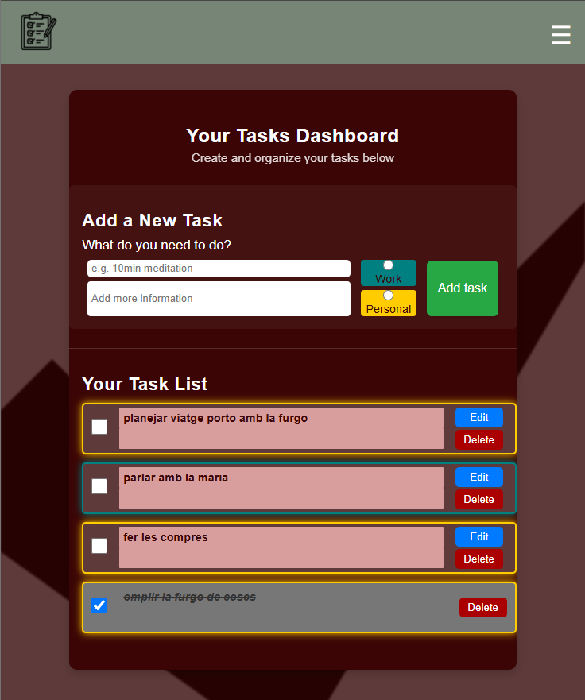

# ✅ Vue To-Do App with Supabase

A responsive and feature-rich to-do list application built with Vue 3, Pinia, Vue Router, and Supabase. Users can sign up, log in, manage their own private tasks (add, edit, delete, mark as done), and log out securely. The layout is responsive, ensuring usability across mobile and desktop devices.

---

## ✨ Features

- 🔐 User Authentication (Sign Up / Log In / Log Out)
- 🧾 Add, Edit, Delete, and Mark Tasks as Done
- 👤 Tasks are private and linked to each user account
- ⚙️ State Management with Pinia
- 🧭 Routing with Vue Router
- 📡 Backend with Supabase (auth + database)
- 📱 Fully Responsive CSS layout
- ⚡ Fast and Lightweight

---

## 📸 Screenshots



---

## 🛠️ Tech Stack

- [Vue 3](https://vuejs.org/)
- [Pinia](https://pinia.vuejs.org/)
- [Vue Router](https://router.vuejs.org/)
- [Supabase](https://supabase.com/)
- [Vite](https://vitejs.dev/)
- CSS (Responsive Design)

---

## 🚀 Getting Started

### Prerequisites

- [Node.js](https://nodejs.org/)
- A [Supabase](https://supabase.com/) account and project

---

### Installation

1. **Clone the repository:**

```bash
git clone https://github.com/Aina-VM/FinalProject2025Aina
cd vue-todo-app
```

2. **Install dependencies:**

```bash
npm install
```

3. **Set up your environment variables:**

Create a `.env` file in the root directory:

```env
VITE_SUPABASE_URL=your-supabase-url
VITE_SUPABASE_ANON_KEY=your-anon-key
```

4. **Start the development server:**

```bash
npm run dev
```

---

---

## 📁 Project Structure

```
src/
├── assets/            # Static assets
├── components/        # Reusable UI components
├── store/             # Pinia store modules
├── views/             # Route components (pages)
├── router/            # Vue Router setup
├── App.vue            # Root component
├── main.js            # App entry point
```

---

## 💡 Ideas for Improvement

- 🌙 Add dark mode toggle
- 📆 Add due dates and sorting by deadline
- 📝 Include task descriptions or tags
- 🔄 Enable real-time sync with Supabase subscriptions
- 📊 Dashboard with task stats or progress tracking
- 🔔 Add local or email reminders
- 🖼️ Drag-and-drop task ordering

---


---

## 📬 Contact

Made by Aina Val Martí  
📧 ainaval25@gmail.com  
📦 GitHub: Aina-VM(https://github.com/Aina-VM)
